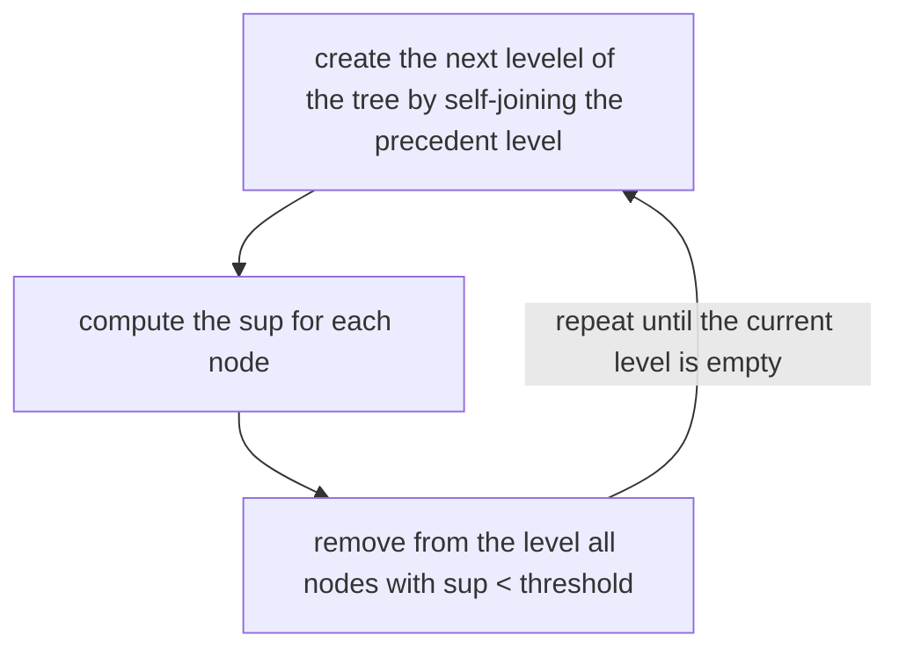

- [~] ---
id: APRIORI ALGORITHM
aliases: []
tags: []
index: 5
---

# APRIORI ALGORITHM

The apriori algorithm is a strategy to prune the three of candidates of the [frequent item-set generation](FREQUENT_ITEMSET_GENERATION.md) fase it's based on the apriori priciple

### APRIORI PRINCIPLE
If an itemset is frequent, then all of its subsets must also be frequent and viceversa.
We can see this principle as follows:

$$
\forall X,Y: (X \subset Y) \implies sup(X) \geq sup(Y)
$$

this implies that there is no need to compute $sup$ of an itemset that contains an itemset with a $sup \lt threshold$

## THE ALGORITHM

The algorithm prunes sub-trees which have a root node with a $sup \lt threshold$

The $threshold$ value it's an important tuning parameter for complexity and the tradeoff element between number of valid time-sets founded and quality of the item-sets founded

[PREVIOUS](FREQUENT_ITEMSET_GENERATION.md) [NEXT](FP-GROWTH.md)
