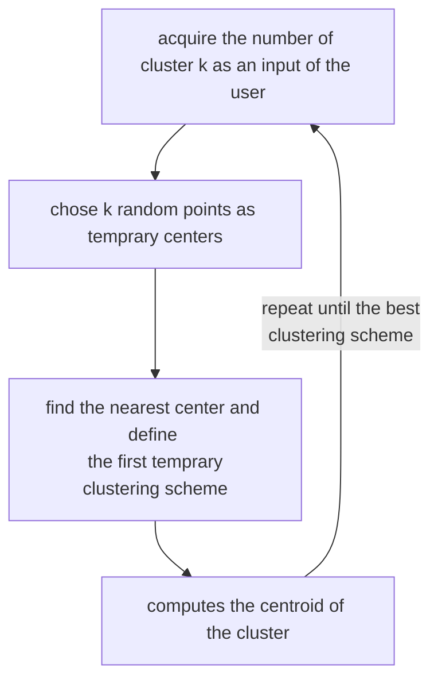

# K-MEANS

algorithm for finding the best clustering scheme

## PROCEDURE

## DISTORTION (*SUM OF SQUARE ERRORS SSE*)

is the sum of all distances between an element $x_{i}$ of the dataset and it's encoded/decoded output squared

$$
\sum_{i=1}^{N}{(x_{i}-Decode(Encode(x_{i}))^2} \space with:
$$
$$
Encode: \mathbb{R}^{D}\to [1 ... K]
$$
$$
Decode: [1 ... K]\to \mathbb{R}^{D} 
$$

it measures **how much the clustering scheme change the dataset**

so in order to have a minimal distortion of the dataset:

- the $Encode$ function must translate $x_{i}$ in the nearest center
- the gradient of the distortion function w.r.t. the center of the cluster must be $0$ so

$$
c_{j}= \frac{1}{|OwnedBy(c_{j})|}\sum_{i\in OwnedBy(c_{j})}{x_{i}}
$$

- each center must be the [centroid](CLUSTERING.md#CENTROID) of the points it owns

## COMPLEXITY

the complexity of the algorithm is :

$$
\mathcal{O}(TKND)\space with:
$$

- $T$  as the number of iterations 
- $K$  as the number of clusters 
- $N$  as the number of data points 
- $D$  as the number of dimensions

