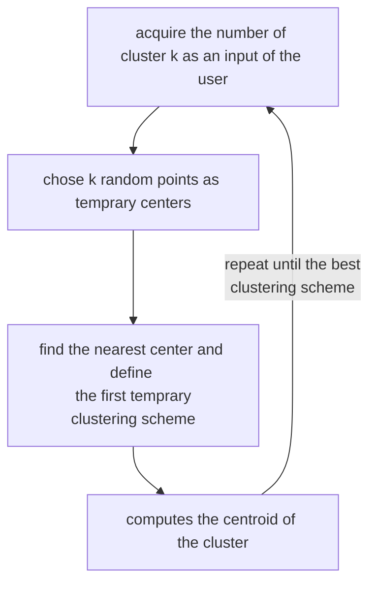

# K-MEANS

algorithm for finding the best clustering scheme

## PROCEDURE

## DISTORTION (*SUM OF SQUARE ERRORS SSE*)

is the sum of all distances between an element $x_{i}$ of the dataset and it's encoded/decoded output squared

$$
\sum_{i=1}^{N}{(x_{i}-Decode(Encode(x_{i}))^2} \space with:
$$
$$
Encode: \mathbb{R}^{D}\to [1 ... K]
$$
$$
Decode: [1 ... K]\to \mathbb{R}^{D}
$$

it measures **how much the clustering scheme change the dataset**

so in order to have a minimal distortion of the dataset:

- the $Encode$ function must translate $x_{i}$ in the nearest center
- the gradient of the distortion function w.r.t. the center of the cluster must be $0$ so

$$
c_{j}= \frac{1}{|OwnedBy(c_{j})|}\sum_{i\in OwnedBy(c_{j})}{x_{i}}
$$

- each center must be the [centroid](CLUSTERING.md#CENTROID) of the points it owns

## CHOOSING STARTING POINT

choosing the starting point correctly is important, some possible choices are:

- select random starting points
- choose the $2...k$ starting point as far as possible from the previious ones

## CHOOSING THE $k$ NUMBER OF CLUSTERS

choosing the $k$ number of clusters correctly is important, one possible strategy is to use a quantitive evaluation of the quality of the clustering scheme.

The best value to aim to is a compromise between the minimization of intra-cluster distances and the maximization of the inter-cluster distances

## EMPTY CLUSTER

during the clustering some clusters can become empty, so in this case there are 2 choices:

- choose a new [centroid](CLUSTERING.md#CENTROID)  away from the empty one
- choose a new [centroid](CLUSTERING.md#CENTROID) at random with the maximum **SSE** in order to split in half the cluster with the lowest quality

## OUTLIERS

there can be points far away from the  [centroid](CLUSTERING.md#CENTROID), this points are a bad influence for the [SSE](#DISTORTION_(*SUM_OF_SQUARE_ERRORS_SSE*)), in some cases this points need to be removed
## COMPLEXITY

the complexity of the algorithm is :

$$
\mathcal{O}(TKND)\space with:
$$

- $T$  as the number of iterations
- $K$  as the number of clusters
- $N$  as the number of data points
- $D$  as the number of dimensions

## PROS

- kmeans is efficient nearly linear in the number of datapoints

## CONS

- k-means cannot work in space where [distance](DISTANCES.md) cannot be computed
- cannot work with nominal data
- requires the K parameter (it can be computed but it is a cost)
- it is very sensitive to outliers
- does not deal with noise
- does not deal properly with non convex clusters

[PREVIOUS](CLUSTERING_SCHEME_EVALUATION.md) [NEXT](HIERARCHICAL_CLUSTERING.md)
