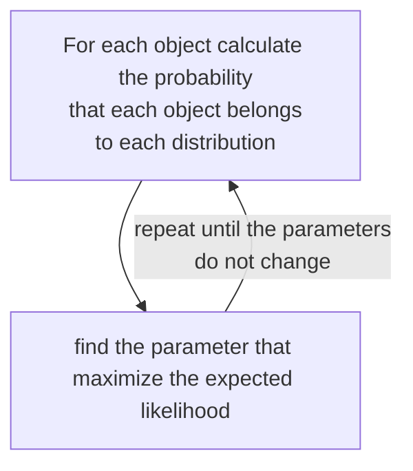

# MODEL BASED CLUSTERING

The objective is to estimate the parameter of a statistical model

## EXPECTATION MAXIMIZATION

```mermaid
flowchart TD
	A[For each object calculate the probability\n that each object belongs to each distribution];
	B[find the parameter that maximize the expected likelihood];
	A-->B
	B-->|repeat until the parameters \n do not change|A

```

[PREVIOUS](HIERARCHICAL_CLUSTERING.md) [NEXT](DENSITY_BASED_CLUSTERING.md)
