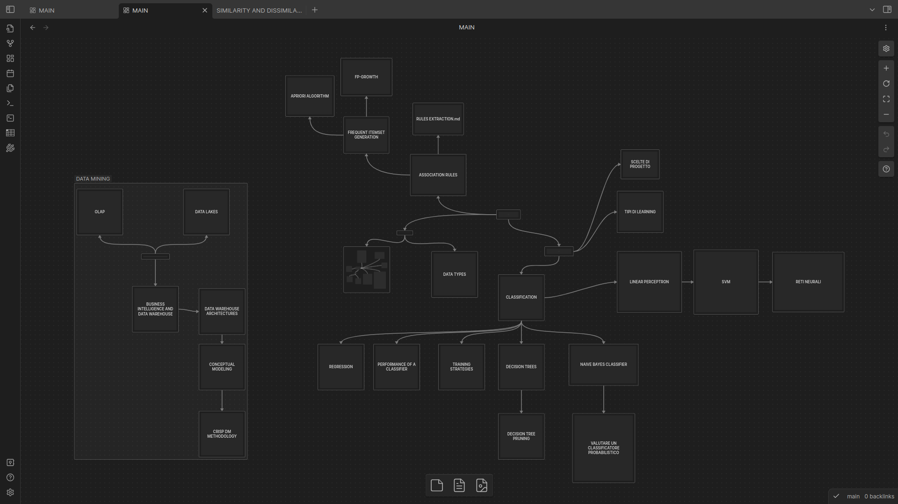

# DATAMINING

this are my personal notes on datamining course of professor Sartori


## HOW TO USE
- install [obsidian](https://obsidian.md/)
- [clone the repository](https://github.com/carnivuth/gip.git)
- [add the repo as obsidian vault](https://help.obsidian.md/Files+and+folders/Manage+vaults#Create+vault+from+an+existing+folder)

it's possible to use the repo without obsidian but in order to get the best experience you need to install it

## HOW TO RUN THE CODES

the labs folder contains the exercises of the course, it's meant to be use with a python virtual environment

```bash
# enter inside labs directory
cd datamining/labs

# create virtual env 
python -m venv env

# activate virtual env
source env/bin/activate

# install dependencies
pip install -r requirements.txt
```

## MAP




## CREDITS

- [carnivuth](https://github.com/carnivuth)
- [stef-a99](https://github.com/stef-a99)
- [kuri0317](https://github.com/kuri0317)
- [claudiacitera](https://github.com/claudiacitera)